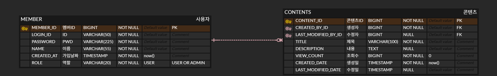

# CMS REST API

  간단한 CMS(Contents Management System) REST API 프로젝트입니다.
  
  콘텐츠 CRUD, 회원가입/로그인, 권한 처리, 예외 처리 기능을 구현했습니다.

  ## 기술 스택

  - Java 25
  - Spring Boot 4
  - Spring Security
  - Spring Data JPA
  - H2 Database
  - Gradle
  - Lombok

  ## 실행 방법

  ### 1. 요구 사항
  - Java 25
  - Gradle Wrapper 사용

  ### 2. 프로젝트 실행
  Windows:
 ```powershell
  .\gradlew.bat bootRun
 ```
  Mac / Linux:
```bash
  ./gradlew bootRun
```
  ### 3. 접속 정보

  - Base URL: http://localhost:8080
  - H2 Console: http://localhost:8080/h2-console

  ### 4. H2 접속 정보

  - JDBC URL: jdbc:h2:mem:test
  - Username: sa
  - Password: 없음
    
### 5. 데이터베이스 설계(ERD)




  ## 테스트 계정

  ### 일반 사용자

  - loginId: ghkd5370
  - password: tjdgus1005!

  ### 관리자

  - loginId: admin
  - password: admin123

  ### 일반 사용자 2

  - loginId: ghkdghkd
  - password: tjdgus1005!

  ## 구현 내용

  ### 회원

  - 회원가입
  - 로그인
  - 로그아웃

  ### 콘텐츠

  - 콘텐츠 생성
  - 콘텐츠 목록 조회
  - 콘텐츠 상세 조회
  - 콘텐츠 수정
  - 콘텐츠 삭제
  - 페이징 처리

  ### 권한 처리

  - 로그인한 사용자만 콘텐츠 생성 가능
  - 콘텐츠 작성자 본인만 수정/삭제 가능
  - 관리자(ROLE_ADMIN)는 모든 콘텐츠 수정/삭제 가능

  ### 예외 처리

  - 존재하지 않는 콘텐츠 조회 시 예외 처리
  - 삭제된 콘텐츠 접근 시 예외 처리
  - 권한 없는 수정/삭제 요청 예외 처리
  - 로그인 실패 예외 처리
  - 회원가입 중복 아이디 예외 처리
  - 비밀번호 확인 불일치 예외 처리

  ## 추가 구현 기능

  - BCrypt를 이용한 비밀번호 암호화
  - Spring Security + SecurityContext 기반 세션 인증
  - 콘텐츠 소프트 삭제
  - 전역 예외 처리(@RestControllerAdvice)
  - 조회수 증가 로직 적용

  ## 인증 / 인가 방식

  Spring Security를 사용했고, 로그인 성공 시 SecurityContext를 세션에 저장하는 방식으로 인증을 처리했습니다.
  
  세션을 사용하여 과제 범위와 구현 복잡도를 고려하여 세션 기반 인증 방식을 선택했습니다.

  ## 조회수 정책

  - 비로그인 사용자가 콘텐츠 상세 조회 시 조회수 증가
  - 로그인한 다른 사용자가 콘텐츠 상세 조회 시 조회수 증가
  - 콘텐츠 작성자 본인이 상세 조회하는 경우 조회수 증가하지 않음

  ## 예외 응답 형식

  예외 발생 시 아래와 같은 형식으로 응답합니다.
```json
  {
    "status": 404,
    "message": "존재하지 않는 콘텐츠입니다."
  }
```
  ## REST API 문서

  자세한 API 명세는 [API.md](./API.md)를 참고해주세요.

  ### 회원 API

  - POST /members/signup : 회원가입
  - POST /members/login : 로그인
  - POST /members/logout : 로그아웃

  ### 콘텐츠 API

  - POST /contents : 콘텐츠 생성
  - GET /contents : 콘텐츠 목록 조회
  - GET /contents/{contentId} : 콘텐츠 상세 조회
  - PATCH /contents/{contentId} : 콘텐츠 수정
  - DELETE /contents/{contentId} : 콘텐츠 삭제

## 검증 및 테스트 과정

본 프로젝트는 안정적인 서비스 제공을 위해 다음과 같은 검증 과정을 거쳤습니다. 시간 관계상 자동화된 테스트 코드(JUnit)를 포함하지는 못했으나, 도구를 활용하여 실무 수준의 케이스 검증을 완료했습니다.

 ### 1. Postman을 활용한 API 시나리오 테스트
- **Happy Path:** 회원가입부터 로그인, 콘텐츠 생성 및 상세 조회까지 이어지는 정상 흐름을 검증했습니다.
- **Edge Case (예외 상황):** 존재하지 않는 리소스 접근, 유효하지 않은 입력 값, 권한이 없는 사용자의 수정/삭제 요청 등 다양한 예외 상황에 대한 응답 메시지와 상태 코드를 확인했습니다.
- 모든 API 응답 결과는 `API.md` 파일에 실제 호출 결과 기반으로 명시되어 있습니다.

 ### 2. AI 도구(Codex/ChatGPT) 활용 및 코드 검토
- **Spring Security 구조 검토:** `SecurityContext`를 직접 세션에 저장하는 방식의 구현 정합성과 인증/인가 흐름에 대해 AI와 함께 검토하며 보안 취약점을 최소화했습니다.
- **예외 처리 브레인스토밍:** `GlobalExceptionHandler`에서 놓칠 수 있는 런타임 에러 케이스를 AI와 논의하여, 비즈니스 로직 전반에 걸쳐 일관성 있는 방어 코드를 작성했습니다.

 ### 3. 기능 및 권한별 수동 테스트 (QA)
- **Role-Based Access Control (RBAC):** 비로그인 사용자, 일반 사용자(USER), 관리자(ADMIN) 각 권한별로 접근 가능한 리소스와 차단되는 기능을 개별적으로 교차 테스트했습니다.
- **비즈니스 로직 검증:** 
  - 콘텐츠 상세 조회 시 **작성자 본인 제외 조회수 증가** 로직이 정상 작동하는지 확인했습니다.
  - **소프트 삭제(Soft Delete)** 적용 시 목록 및 상세 조회에서 제외되는지, 삭제된 리소스에 대한 재접근 시 410(Gone) 코드가 발생하는지 확인했습니다.


## 구현하면서 고려한 사항

  - 요청 DTO와 인증 사용자 정보를 분리하여, 클라이언트가 임의의 memberId를 보내지 않도록 수정했습니다.
  - 콘텐츠 삭제는 실제 삭제 대신 상태값(DEACTIVE)을 변경하는 소프트 삭제 방식으로 처리했습니다.
  - 콘텐츠 관련 예외와 회원 관련 예외를 분리하여 응답 코드를 일관성 있게 관리했습니다.


## 사용한 AI 도구 

  - AI 도구: ChatGPT, Codex
  - 활용 방식:
      - 수동 API 테스트 시나리오 정리 및 검증 보조
      - Spring Security 세션 인증 구조 검토
      - 예외 처리 구조 정리
      - Gradle 실행 환경 문제 점검
      - README 및 API 문서 정리 보조
